# Análise de Dados - Datasets Olist

> Análise estatística e visual de datasets relacionados a uma loja que vende diversos produtos, abordando insights sobre receita, sellers, categorias, variações de preço, e outros fatores.

---

## 📖 Descrição

Este projeto realiza a análise de dados de uma loja online utilizando diversos datasets. O objetivo principal é extrair insights por meio de estatísticas descritivas e gráficos. As análises incluem dados dos últimos 12 meses, abordando receitas, avaliações, sellers, e outros aspectos relevantes para entender o desempenho da loja.

---

## Link do Vídeo

Realizei o upload do vídeo no OneDrive, segue o link para acessá-lo: https://compasso-my.sharepoint.com/:v:/r/personal/emanuelle_lima_pb_compasso_com_br/Documents/emanuelle.lima-sprint02.mp4?csf=1&web=1&nav=eyJyZWZlcnJhbEluZm8iOnsicmVmZXJyYWxBcHAiOiJPbmVEcml2ZUZvckJ1c2luZXNzIiwicmVmZXJyYWxBcHBQbGF0Zm9ybSI6IldlYiIsInJlZmVycmFsTW9kZSI6InZpZXciLCJyZWZlcnJhbFZpZXciOiJNeUZpbGVzTGlua0NvcHkifX0&e=YW5ZI6

## 📊 Datasets Utilizados

Os datasets analisados neste projeto são:

- **olist_orders_dataset.csv**: Informações sobre os pedidos realizados.
- **olist_order_items_dataset.csv**: Detalhes dos itens comprados em cada pedido.
- **olist_products_dataset.csv**: Dados sobre os produtos disponíveis na loja.
- **olist_sellers_dataset.csv**: Informações dos vendedores cadastrados na plataforma.
- **olist_order_reviews.csv**: Avaliações dos clientes com scores de 1 a 5.

---

## 🎯 Funcionalidades e Objetivos do Projeto

Este projeto responde, de forma estatística e visual, as seguintes perguntas relacionadas aos últimos 12 meses:

1. **Categorias com maior e menor receita.**
2. **Top 10 maiores sellers (com maior receita).**
3. **Top 10 piores sellers (com menor receita).**
4. **Existem sellers que vendem o mesmo produto? Qual a variação de preço praticada entre os sellers?**
5. **Houve inflação no preço dos produtos ao longo do tempo? Qual foi a variação em % e R$?**
6. **Top 10 melhores sellers (com mais reviews positivas).**  
   - Critério: Reviews boas possuem score ≥ 4 e count >= 5.
7. **Top 10 piores sellers (com mais reviews negativas).**  
   - Critério: Reviews ruins possuem score ≤ 2 e count >= 5.
8. **Relação entre quantidade de vendas e quantidade de reviews.**  
   - É possível identificar aumento ou queda nas vendas com base em avaliações passadas?
9. **Insight livre.**  
   - Estados com maiores receitas.

---

## 📊 Gráficos Gerados

### 1. Categorias com maior e menor receita
- Gráfico de barras exibindo as categorias com maior e menor receita.
  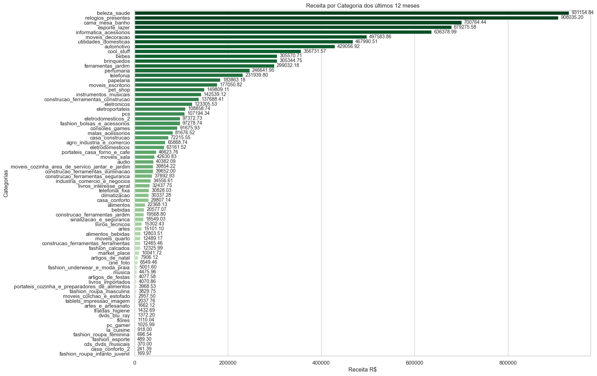

### 2. Top 10 maiores sellers
- Gráfico de barras destacando os sellers com maior receita.
  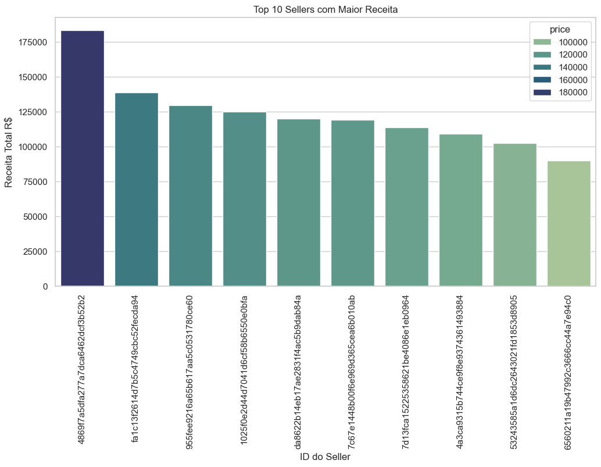

### 3. Top 10 piores sellers
- Gráfico de barras destacando os sellers com menor receita.
  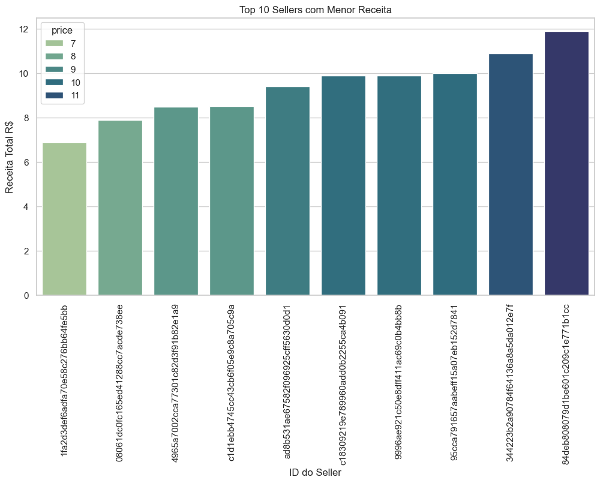

### 4. Variação de preços entre sellers que vendem o mesmo produto
- Gráfico de barras horizontais mostrando a variação de preços entre os sellers.
  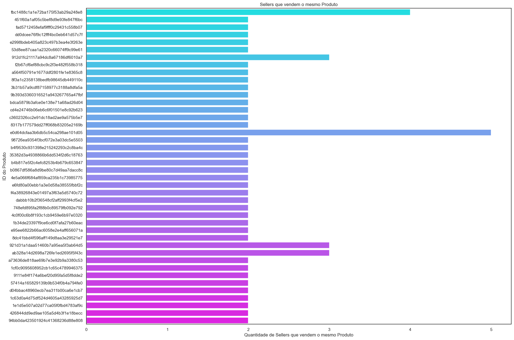
  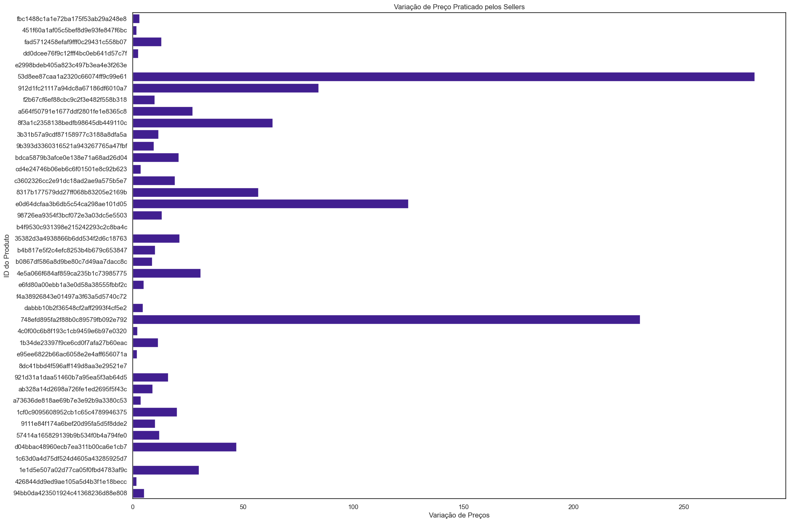

### 5. Inflação nos preços dos produtos
- Linha do tempo com a variação média dos preços ao longo dos meses.
  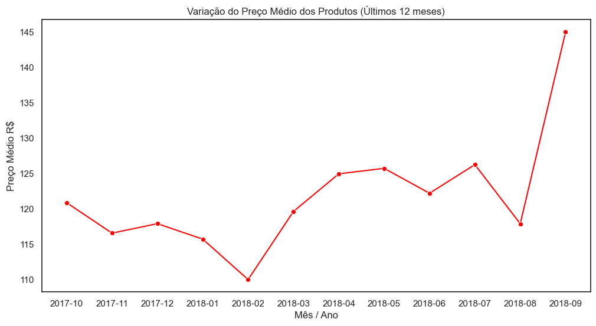

### 6. Top 10 melhores sellers (reviews positivas)
- Gráfico de barras destacando os sellers com mais reviews positivas.
  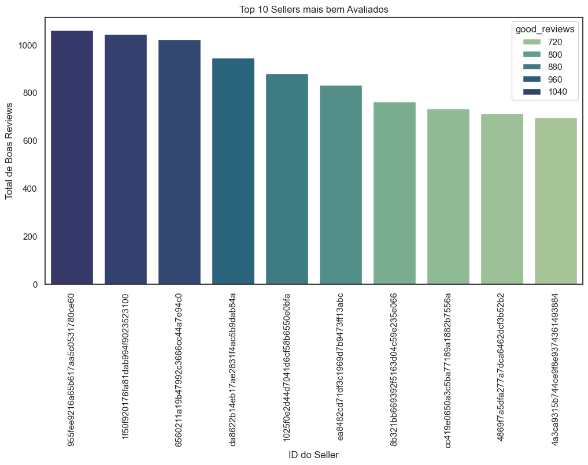

### 7. Top 10 piores sellers (reviews negativas)
- Gráfico de barras destacando os sellers com mais reviews negativas.
  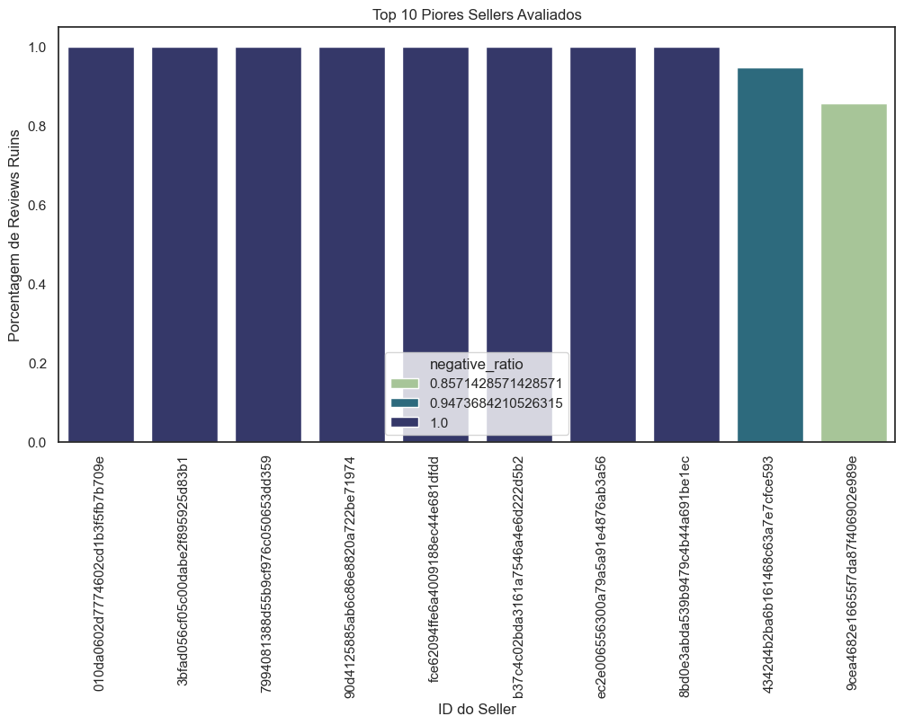

### 8. Relação entre vendas e reviews
- Gráfico de dispersão mostrando a relação entre quantidade de vendas e reviews.
  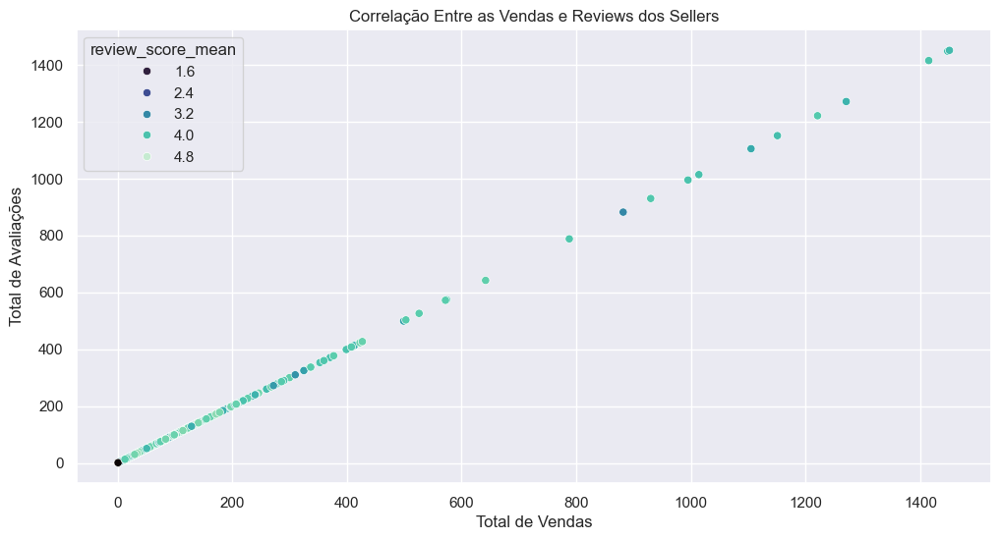
  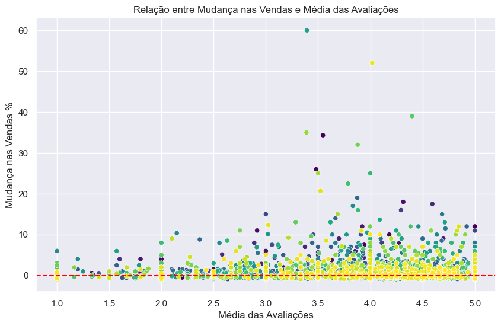

### 9. Insight livre
- Gráfico de barras destacando os 5 estados com maior receita.
  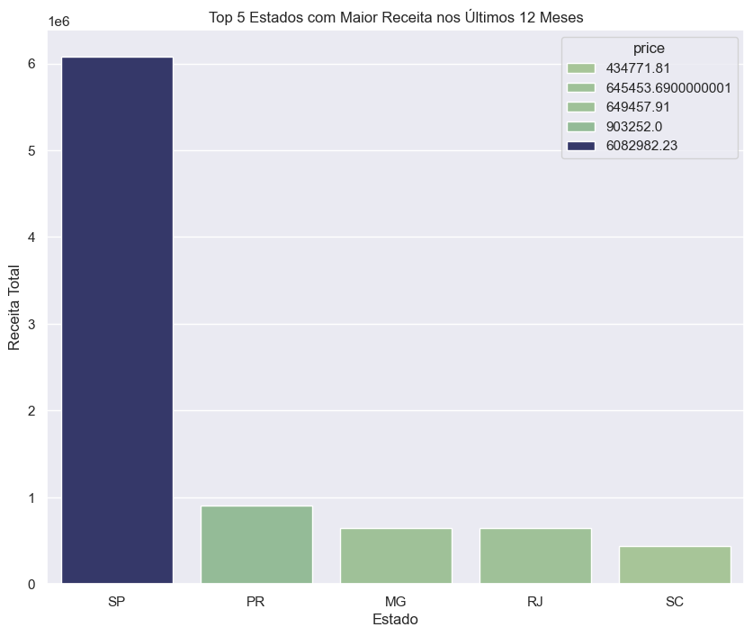

---

## 💻 Tecnologias Utilizadas

- **Linguagens**: Python
- **Bibliotecas**:
  - Pandas: manipulação de dados
  - Numpy: manipulação de métodos matemáticos
  - Datetime: manipulação de datas
  - Matplotlib: geração de gráficos
  - Seaborn: visualizações avançadas
- **Ferramentas**:
  - Jupyter Notebook: ambiente interativo para análise de dados