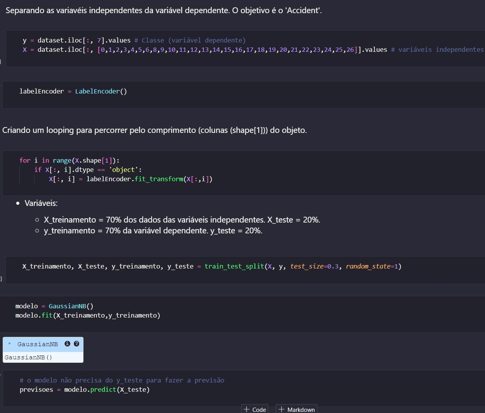
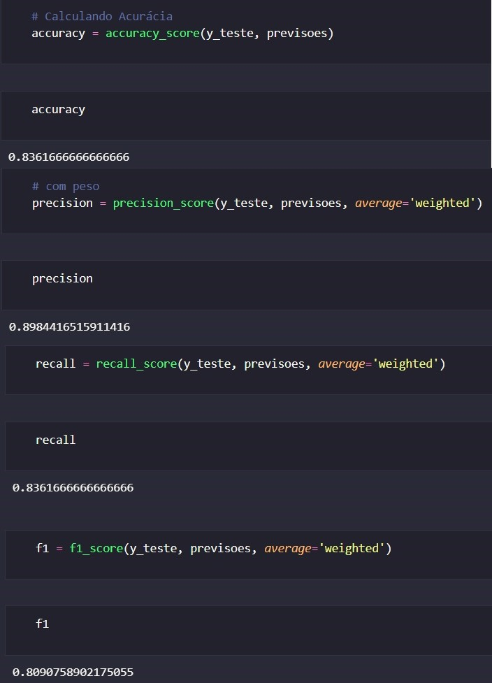
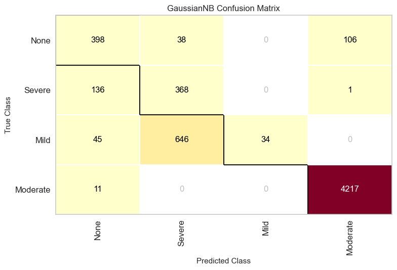
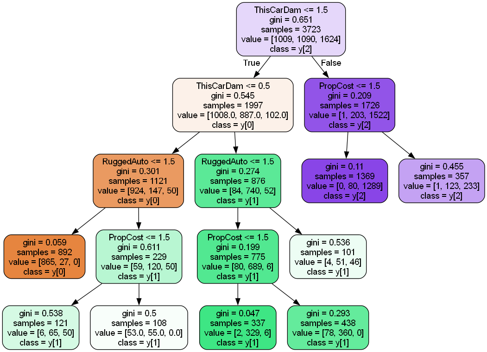
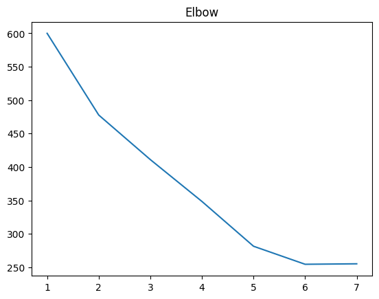
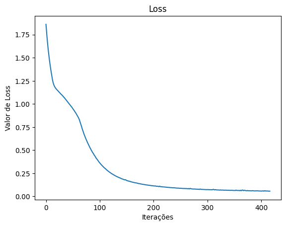
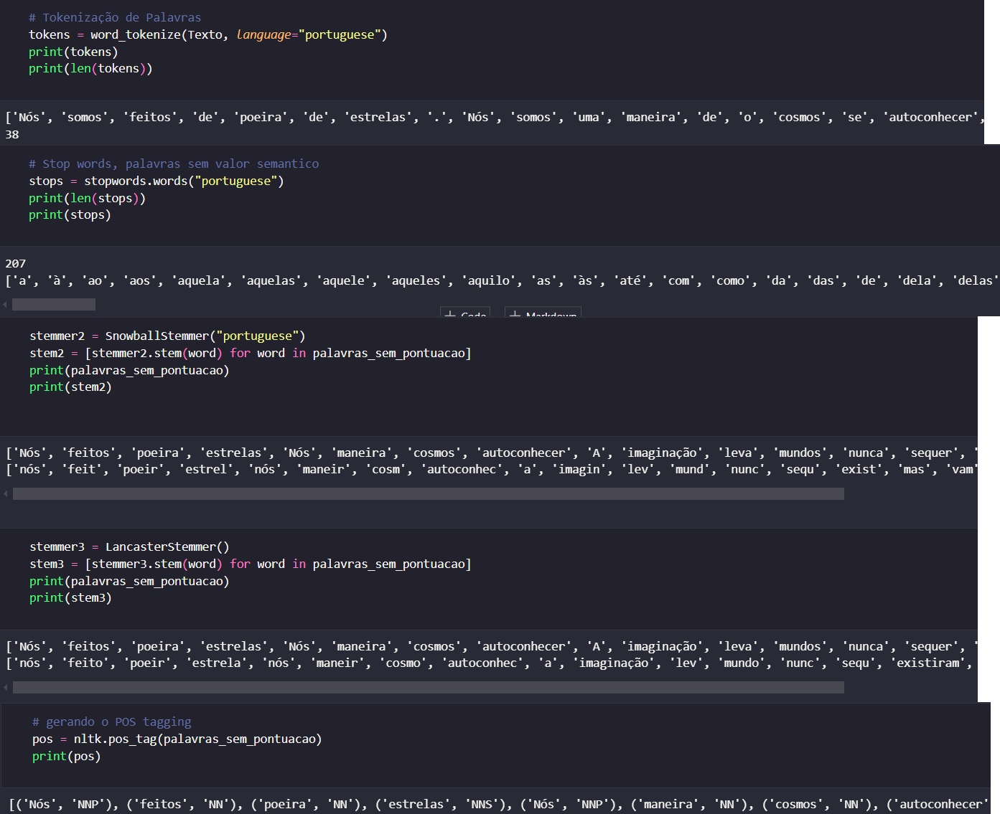

# 📊 Entrega - Sprint 03

## Link do Vídeo
Segue o link do vídeo referente ao desafio da Sprint 03.

https://compasso-my.sharepoint.com/:v:/r/personal/emanuelle_lima_pb_compasso_com_br/Documents/emanuelle.lima-sprint03.mp4?csf=1&web=1&nav=eyJyZWZlcnJhbEluZm8iOnsicmVmZXJyYWxBcHAiOiJPbmVEcml2ZUZvckJ1c2luZXNzIiwicmVmZXJyYWxBcHBQbGF0Zm9ybSI6IldlYiIsInJlZmVycmFsTW9kZSI6InZpZXciLCJyZWZlcnJhbFZpZXciOiJNeUZpbGVzTGlua0NvcHkifX0&e=ADR2b8

---

Nessa Sprint 03, a trilha foi composta de apenas um curso, sendo de **IA e Machine Learning**.

# 📝 Exercícios

Dado que o curso em questão não tiveram seções com exercícios, foi feito o upload de alguns arquivos (não todos) notebooks relacionados a temas abordados em cada seção. Para não ficar massante, e também por motivos de temas que já foram abordados em outras sprints que apenas alguns arquivos serão inseridos no diretório de exercícios. Além disso, conflitos e versões relacionadas a algumas bibliotecas impediram a prática em algumas seções, esses arquivos também não serão inseridos.


1. **Seção 3: Estudo de Algoritmos**:

    ➡️ Confira o notebook de [naive bayes](./exercicios/03%20-%20estudo%20de%20algoritmos/naive-bayes.ipynb).

    ➡️ Confira o notebook de [árvore de decisão](./exercicios/03%20-%20estudo%20de%20algoritmos/decision-tree.ipynb).

    ➡️ Confira o notebook de [random forest](./exercicios/03%20-%20estudo%20de%20algoritmos/random-forest.ipynb).

    ➡️ Confira o notebook de [vizinho mais próximo](./exercicios/03%20-%20estudo%20de%20algoritmos/knn.ipynb).

    ➡️ Confira o notebook de [clusters](./exercicios/03%20-%20estudo%20de%20algoritmos/clusters.ipynb).
    

2. **Seção 4: Tópicos Avançados em Machine Learning**:

    ➡️ Confira o notebook de [engenharia de atributos](./exercicios/04%20-%20topicos%20avancados%20em%20ml/engenharia-atributos.ipynb).

    ➡️ Confira o notebook de [principal component analysis](./exercicios/04%20-%20topicos%20avancados%20em%20ml/pca.ipynb).

    ➡️ Confira o notebook de [técnicas avançadas de cluster](./exercicios/04%20-%20topicos%20avancados%20em%20ml/cluster-avancado.ipynb).

    ➡️ Confira o notebook de [escolhendo o melhor cluster](./exercicios/04%20-%20topicos%20avancados%20em%20ml/melhor-cluster.ipynb).

    ➡️ Confira o notebook de [classificação multi label](./exercicios/04%20-%20topicos%20avancados%20em%20ml/multilabel.ipynb).
    

3. **Seção 5: Redes Neurais, Deep Learning e Visão Computacional**:

    ➡️ Confira o notebook de [implementação do RNA](./exercicios/05%20-%20redes%20neurais,%20dl,%20cv/rna-multilayer-perceptron.ipynb).

    ➡️ Confira o notebook de [RNA com Keras](./exercicios/05%20-%20redes%20neurais,%20dl,%20cv/rna-keras.ipynb).

    ➡️ Confira o notebook de [rede neural convolucional](./exercicios/05%20-%20redes%20neurais,%20dl,%20cv/cnn.ipynb).

4. **Seção 7: Processamento de Linguagem Natural e LLMs**:

    ➡️ Confira o notebook de [NLP na prática](./exercicios/07%20-%20nlp%20e%20llm/).


5. **Seção 9: Detecção de Anomalias**:

    ➡️ Confira o notebook de [local outlier factor](./exercicios/09%20-%20deteccao%20de%20anomalias/lof.ipynb).

    ➡️ Confira o notebook de [isolation forest](./exercicios/09%20-%20deteccao%20de%20anomalias/isolation-forest.ipynb).


# 📂 Evidências

Nesse curso, foram apresentados desde conceitos introdutórios de machine learning como aplicações, estrutura dos dados, métricas de avaliação de desempenho, até conceitos avançados como engenharia de atributos, avaliação de desempenho do modelo, redes neurais, processamento de linguagem natural e detecção de anomalias.

- **Previsão com Machine Learning**  
  - O principal objetivo de utilizar modelos de Machine Learning é prever a classe final. Na imagem a seguir, é mostrado o processo de previsão passando pela separação das variáveis indepentendes e dependentes, codificação de categorias, criação do modelo e previsão. É importante destacar que o algoritmo utilizado abaixo é o Naive Bayes, mas o processo de previsão de outros algoritmos como árvore de decisão é bem parecido.
  


  - Além disso, também foram calculadas as métricas de avaliação de performance de modelo como acurácia, previsão, recall e f1 score.
  

  - Um outro aspecto interessante é que dado os valores das métricas de avaliação de performance é possível gerar a matriz de confusão, no caso do exemplo acima essa foi a matriz gerada:
  

  - Ainda sobre algoritmos de previsão, segue evidências de uma das árvores geradas. O processo é bem parecido com o de naive bayes, com diferença para a criação do modelo. No caso das árvores de decisão, a criação acontece, por exemplo, a partir do seguinte código:
  ```
    modelo = DecisionTreeClassifier(random_state=1, max_depth=8, max_leaf_nodes=8)
    modelo.fit(X_treinamento, y_treinamento)
  ```

 

- **Clusterização com KMeans e DBSCAN**
  - Para a análise de clusterização, foram utilizados os algoritmos KMeans e DBSCAN. Abaixo estão os gráficos que mostram os resultados da clusterização em um conjunto de dados.

  <p align="center">
    
    
  </p>

  O KMeans agrupa os dados em clusters esféricos, enquanto o DBSCAN é mais robusto para lidar com dados com formatos não lineares e outliers.

- **Técnicas Avançadas de Clusterização**
  - Uma técnica avançada frequentemente usada para determinar a quantidade ideal de clusters é o método do cotovelo (Elbow Method). Abaixo, o gráfico mostra a relação entre a soma dos quadrados intra-cluster (Inertia) e o número de clusters. O ponto em que o gráfico decresce de inércia se torna menos acentuado e indica o número ideal de clusters para o conjunto de dados (5).  
  

- **Redes Neurais e Classificação com Perceptron**  
  - O Perceptron ajusta os pesos de forma iterativa com base nos erros cometidos durante o treinamento.  
  - Segue abaixo o gráfico que demonstra a evolução da função de perda (loss) durante o treinamento do modelo. 
    

  Esse gráfico é importante para entender como o algoritmo está convergindo e se está aprendendo adequadamente com os dados.  

- **Processamento de Linguagem Natural**  
  - Foram aplicados algumas técnicas referentes as etapas do processamento de linguagem natural, como tokenização, POS taggin e etc.
  


## 🏆 Certificados

Segue abaixo os certificados obtidos nos cursos da Sprint 03:

1. **Curso de IA e Machine Learning**
  


