# 📊 Entrega - Sprint 05

Nessa sprint 05, o objetivo na trilha era desenvolver um projeto de **previsão de preço de carros usados** com regressão, utilizando machine learning e os conhecimentos adquiridos nos cursos anteriores.

## Link do Vídeo
https://compasso-my.sharepoint.com/:v:/r/personal/emanuelle_lima_pb_compasso_com_br/Documents/sprint05-desafio2-emanuelle.lima.mp4?csf=1&web=1&nav=eyJyZWZlcnJhbEluZm8iOnsicmVmZXJyYWxBcHAiOiJPbmVEcml2ZUZvckJ1c2luZXNzIiwicmVmZXJyYWxBcHBQbGF0Zm9ybSI6IldlYiIsInJlZmVycmFsTW9kZSI6InZpZXciLCJyZWZlcnJhbFZpZXciOiJNeUZpbGVzTGlua0NvcHkifX0&e=czMWnN

---

# 💻 Projeto

➡️ Confira o notebook do [projeto de previsão](./previsao-carros.ipynb).

Para realizar o projeto foram necessárias as importações de algumas bibliotecas como: 
 - `pandas`, `numpy`, `seaborn`, `matplotlib`, `shap` e `scikit-learn`.

Além disso, para conseguir visualizar e realizar as alterações na base de dados, é necessário ter o arquivo [cars](https://drive.google.com/file/d/1pw1gp1z7jHKi1ynRgFfY4yEvYbHOLLHg/view?usp=drive_link) presente no meu google drive.

## 🛠️ Etapas do Projeto

- **Amostragem de Dados**: Foi realizada uma amostragem de **25% dos dados** com uma amostra reprodutível (usando `random_state`). O novo conjunto de dados foi composto por cerca de 190 mil registros.
 

    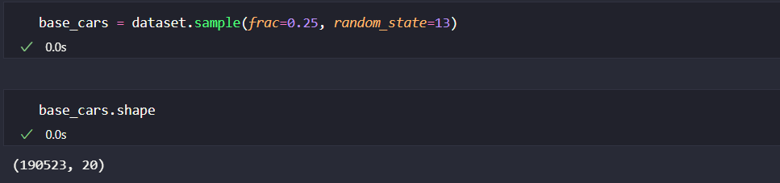
  

- **Análise Exploratória dos Dados**: Na etapa de EDA, a análise das variáveis numéricas foi feita com a estatística descritiva e geração de gráficos como Boxplot, para analisar a ocorrência de outliers e Histogramas para visualizar a distribuição dos dados nas variáveis. Para representar graficamente as análises das variáveis categóricas, foi utilizado gráficos CountPlots.

  - **Boxplots** das varíaveis de `price`, `price_drop` e `mileage` (pós tratamento) respectivamente:
  

    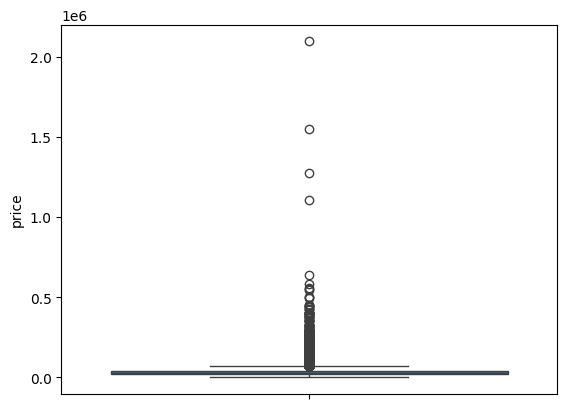
    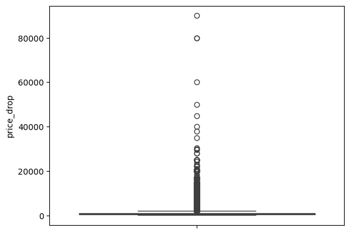
    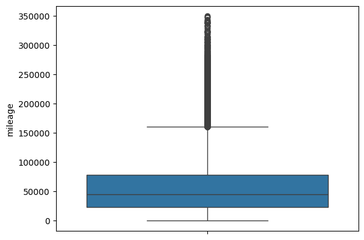
  

  Foram removidos outliers em `mileage` acima de 350k de milhas percorridas e na variável `price` removi apenas o registro que estava preenchido incorretamente, uma vez que a maioria dos valores considerados outliers são os preços reais dos carros. Sobre a variável `price_drop`, por ter mais de 80k de valores faltantes (mostrarei posteriormente) e por fazer o XAI e verificar que não foi uma variável considerada importante para o meu modelo, dropei a coluna.

  - **Histogramas** das variáveis numéricas mais importantes para analisar a distribuição:
  

    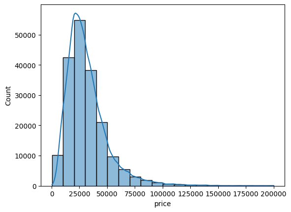
    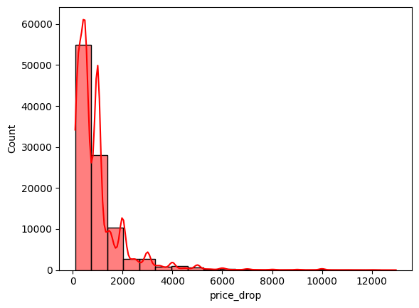
    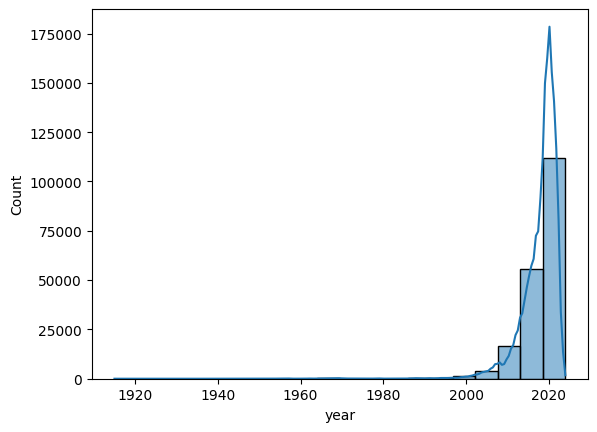
  

  

    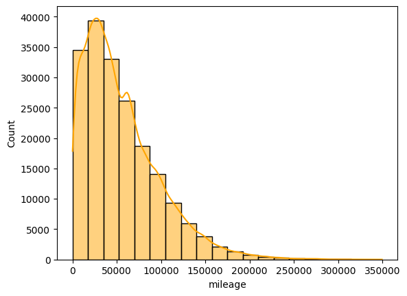
    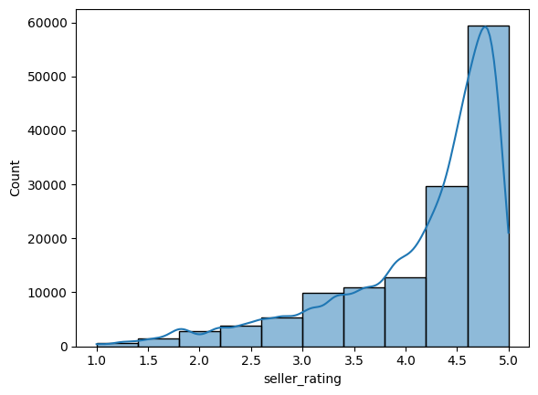
    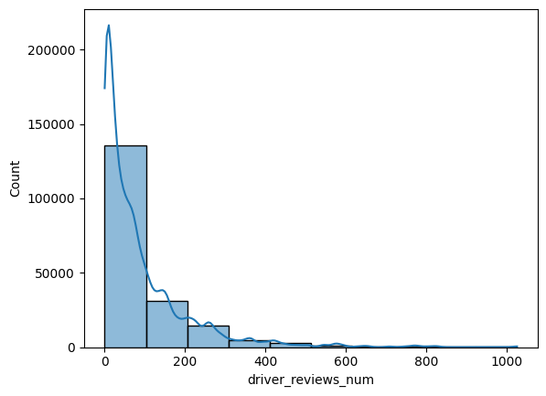
  

  Pode-se perceber que a maioria das distribuições nos histogramas são assimétricas.

  - **Variáveis Categóricas e CountPlots**: Para visualizar a proporção das categorias foram utilizados alguns gráficos (CountPlots) e agrupamentos:
  

    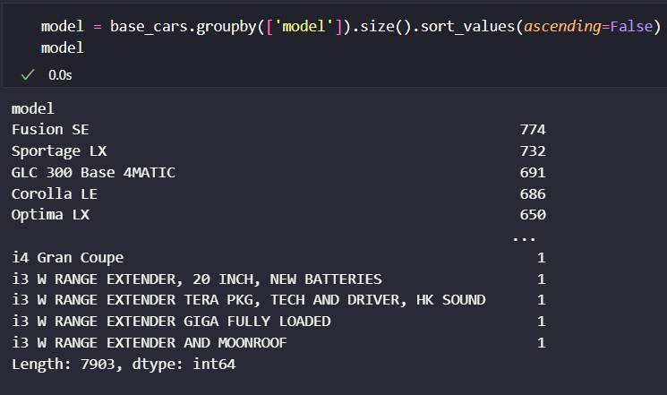
    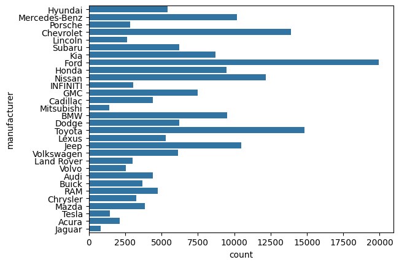
    
  

  

    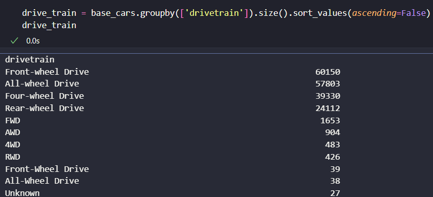
    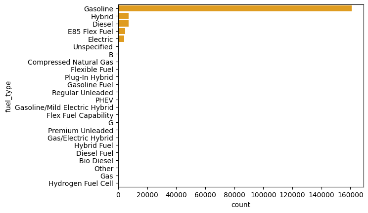
    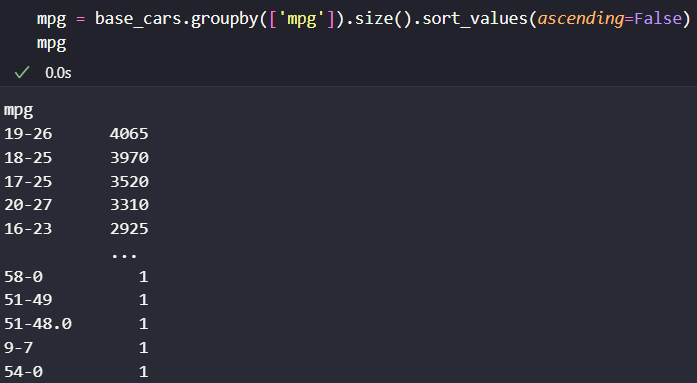
  

  Analisando as variáveis, é perceptível que a maioria delas tem uma boa disposição, com exceção da variável `fuel_type` na qual o tipo *Gasolina* foi a categoria com maior proporção.

  Algumas variáveis, ao chamar o método dtypes do *pandas* possuiam o tipo como float, porém são variáveis categóricas de classificação binária, são elas:

   

    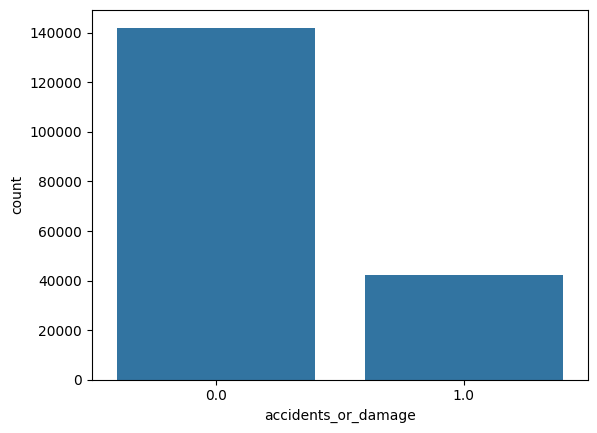
    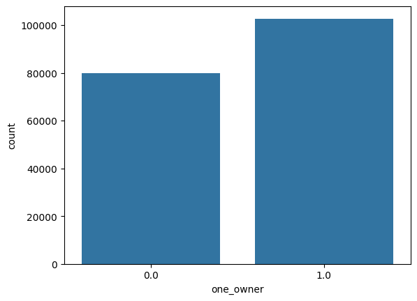
    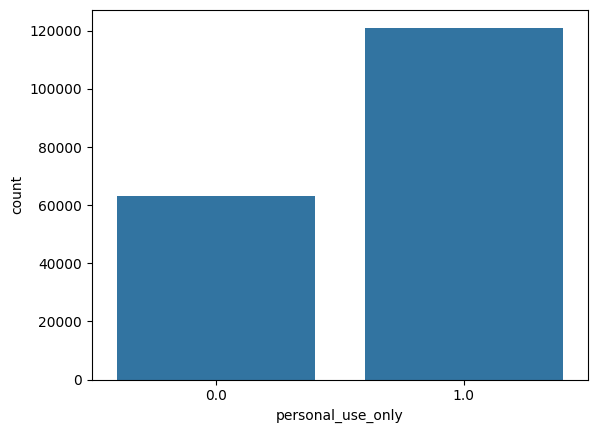
  

  Importante destacar que a coluna de classificação 0.0 é correspondente a *não* e a coluna 1.0 é correspondente a *sim*.

  - Para as **variáveis numéricas** foi feito o gráfico de correlação de *Pearson* para analisar o quanto as variáveis estão associadas a variável objetivo.
  

    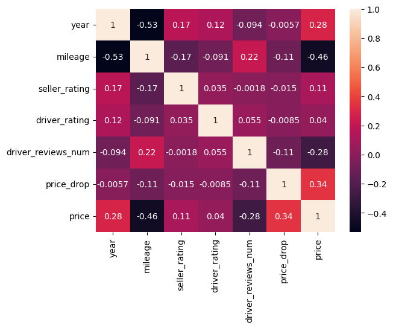
  

  - **Valores Faltantes e Duplicados**:
   - Foram identificados `588` registros duplicados através do método `duplicated()` do *pandas*, que foram removidos logo em seguida.

   - Para verificar a ocorrência de valores faltantes, foi chamado o método `isnull().sum()` do *pandas*, e o resultado foi o seguinte:

   

    
  

  
   - Para tratar os dados faltantes, primeiro foi feita uma análise com técnica de XAI (Machine Learning Explicável), sendo o **Shap Values** para identificar quais variáveis mais causariam impacto no meu modelo. Para isso, treinei alguns modelos com o mesmo dataset usando algoritmos de Regressão Linear, Random Forest e Árvores de Decisão, e posteriormente usei o Shap Values para obter as "melhores" variáveis. Dado isso, escolhi as oito melhores variáveis nesses testes. Assim, tratei os valores nulos apenas dessas variáveis e dropei as restantes. Abaixo, segue os resultados do Shap Values:

   

    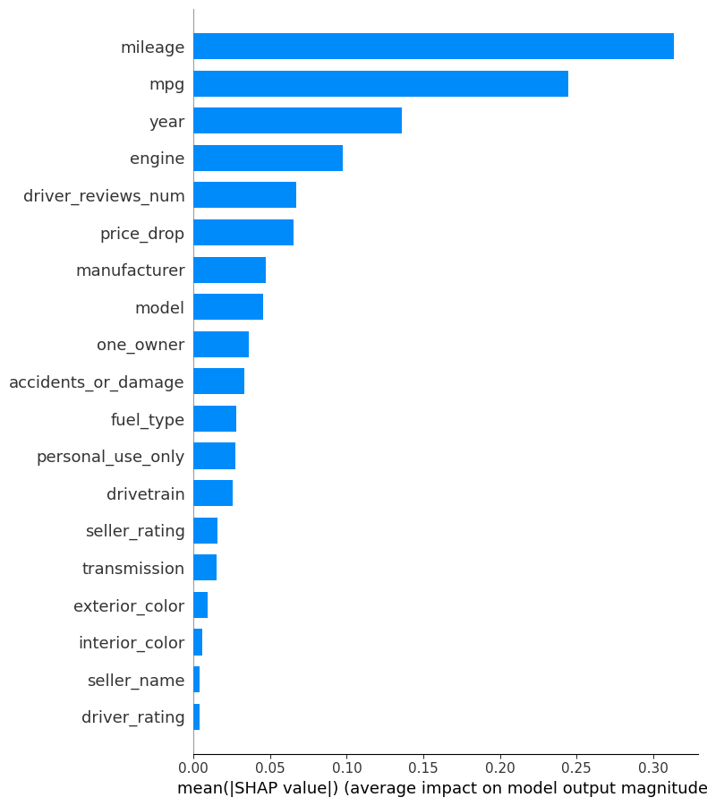
    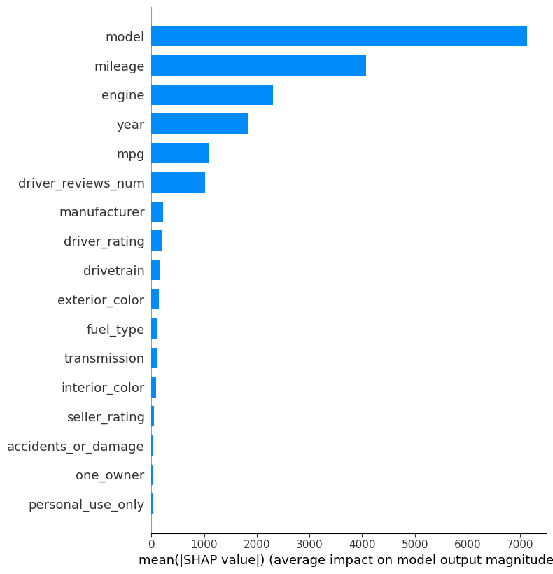
    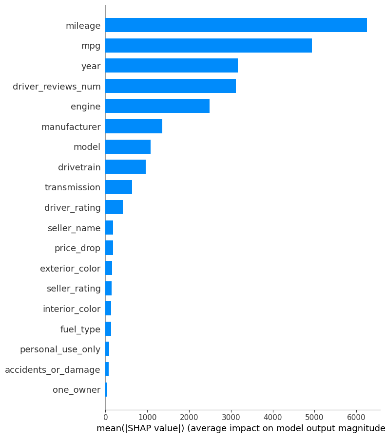
  

  Realizar a etapa da EDA de uma forma mais completa, podendo fazer testes e analisando cada uma das 20 variáveis foi muito satisfatório, uma vez que no primeiro projeto a minha análise acabou sendo mais básica, até mesmo por falta de experiência. Então foi bastante gratificante conseguir desenvolver essa etapa de EDA de uma forma completa, descobrindo padrões e obtendo insights.

- **Pré-Processamento dos Dados**: Nessa etapa, realizei o tratamento (limpeza) e a transformação dos dados, além da divisão dos dados em treino e teste.
  - **Tratamento e limpeza**: Foram feitas as limpezas dos dados removendo as duplicatas e tratando os valores nulos.
  

    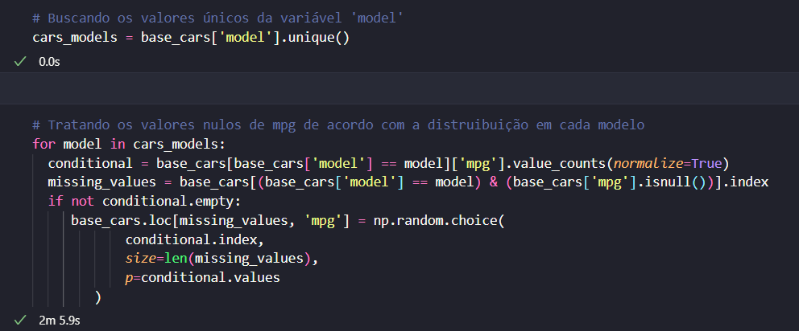
    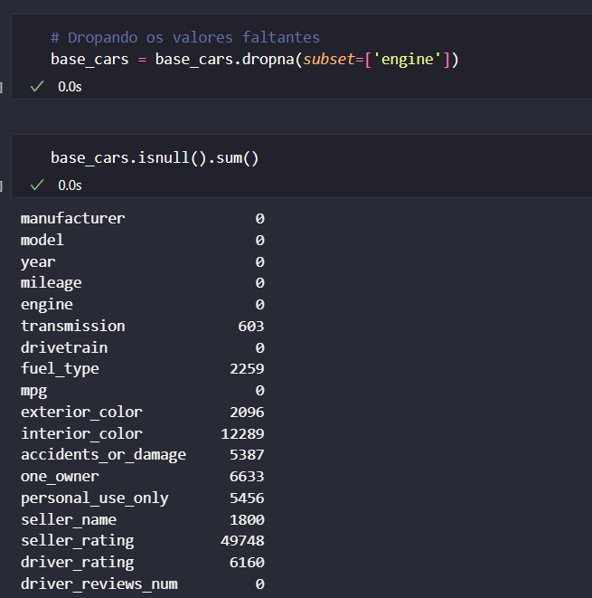
  

Para tratar os valores de `mpg` e `drivetrain` achei interessante fazer uma distruibuição dos valores recorrentes dessas variáveis dado o modelo específico do carro que quero preencher o dado faltante. Para tratar os dados de `engine` preferi dropar os valores. As outras variáveis que posteriormente serão usadas no treinamento do modelo não possuiam valores nulos (imagem a direita).

  - **Divisão do conjunto de dados e Codificação**: Nessa etapa foi realizada a codificação de rótulos com `LabelEncoder` e `TargetEncoder` e a separação das variáveis **X (features)** e **y (target)**.
  

    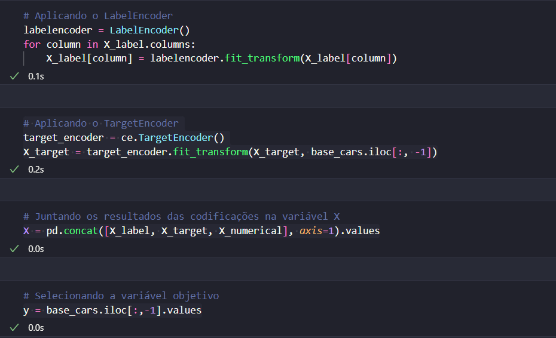
  

A escolha dos algoritmos acima se deu principalmente pela escolha do algoritmo de treinamento do modelo, o **Random Forest** é conhecido por não criar relações ordinais. Outro ponto, é que para as variáveis com poucas categorias foi aplicado o `LabelEncoder`, já para variáveis com muitas categorias foi aplicado o `TargetEncoder`.

  - **Matriz de correlação**: Posteriormente, achei interessanre fazer a identificação das variáveis mais correlacionadas com o preço do carro usando o gráfico de correlação de *Pearson* e de *Spearman*.
  

    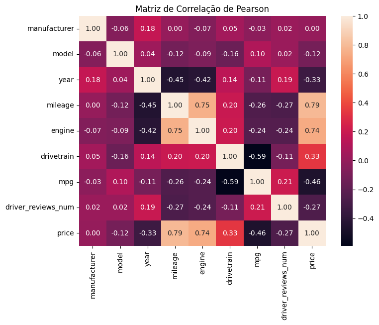
    
  

  - Por último foi feita a divisão em **dados de treino e teste** usando `train_test_split`, sendo 70% do conjunto de dados para treino e 30% para teste.

- **Criação, Treinamento e Previsões do Modelo**:
  - **Modelo escolhido:** Regressor baseado em **Random Forest**.
  - **Treinamento:** Utilização do método `fit()` para ajustar o modelo aos dados de treino.
  - **Previsões:** Realizadas com o método `predict()` no conjunto de teste.

  

    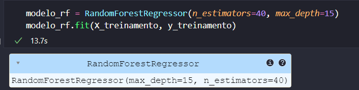
    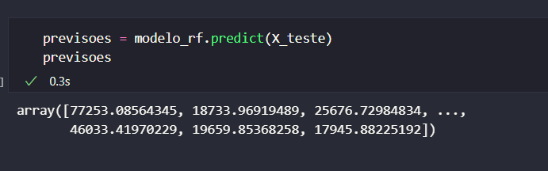
  

- **Avaliação e Métricas**: Nessa etapa, foi realizada a avaliação da performance do modelo utilizando o `score()` e as duas principais métricas sendo `mean_absolute_error` e `mean_squared_error`. Os resultados obtidos foram:
  

    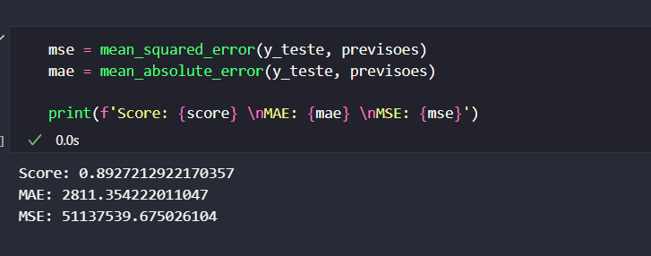
  

  
  Com base nas métricas acima, a conclusão foi de que o modelo é um bom modelo, conseguindo prever e desempenhar bem. A média de erro foi baixa ao pensar no contexto dos preços dos carros e de como são altos. O score de 89% também indica um bom resultado, mostrando que o modelo consegue capturar bem a relação entre as features e a variável objetivo. Dessa forma, também foi notado que apesar de serem boas métricas, ainda cabem melhoras e fica como exercício de limitação para serem superados realizado, por exemplo, mudanças nos parâmetros ou utilizando outros algoritmos de codificação.

- **Variáveis com maior importância**: Por último, era necessário encontrar as variáveis que mais impactaram no modelo, para isso utilizei uma *Técnica de Explainable AI (XAI)*, sendo o uso dos valores de **SHAP** para identificar as duas variáveis mais importantes para o modelo. O resultado entregue pelo *Shap Values* foi de que as variáveis `model` e `mileage` são as mais importantes. Veja abaixo:

  

    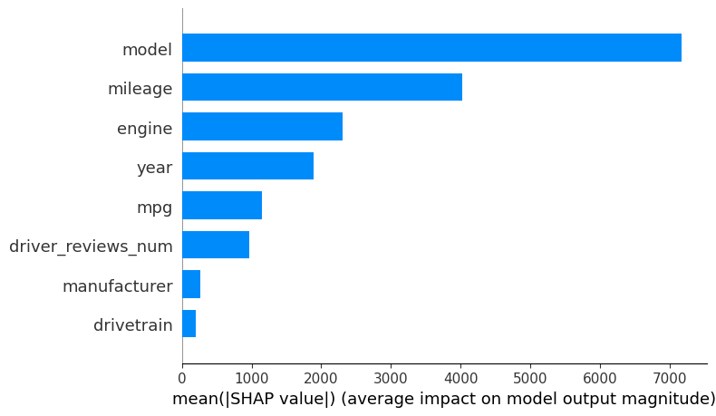
  

- **Comparação com Outros Algoritmos**: Para verificar qual algoritmo de regressão obteria o melhor desempenho, treinei o dataset com modelos como `Regressão Linear`, `Árvores de Decisão`, `Redes Neuraus` e `Random Forest` e após o treinamento avaliei cada modelo. Os resultados:

| Modelo               | MAE (Erro Médio Absoluto) | MSE (Erro Quadrático Médio) | Score (R²) |
|----------------------|---------------------------|-----------------------------|------------|
| **Random Forest**    | 2.811,35                 | 51.137.539,68              | 0,89       |
| **Árvores de Decisão** | 3.560,51                 | 67.936.018,31              | 0,85       |
| **Redes Neurais**    | 4.145,16                 | 60.055.569,08              | 0,86       |
| **Regressão Linear** | 8.542,00                 | 236.087.880,64             | 0,46       |

Como pode ser observado na tabela acima, o algoritmo de **Random Forest** obteve o melhor desempenho nas métricas, e devido a isso e a sua robustez ele foi o algoritmo escolhido para desempenhar no projeto.

Destarte, através desse projeto foi cumprido o desafio de fazer as previsões de preços de carros usados, usando um algoritmo de regressão que foi o Random Forest. O modelo com esse algoritmo teve um bom desempenho, sobretudo comparado aos outros citados acima, com score de 89%. Esse projeto foi uma oportunidade enriquecedora e muito satisfatória de colocar em prática os conhecimentos adquiridos nos cursos do programa.

## Referências

- GeeksforGeeks. Steps for Mastering Exploratory Data Analysis (EDA). Disponível em: https://www.geeksforgeeks.org/steps-for-mastering-exploratory-data-analysis-eda-steps/

- Scikit-learn. Scikit-learn: Machine Learning in Python. Disponível em: https://scikit-learn.org/stable/

- DataCamp. Introduction to SHAP Values: Machine Learning Interpretability. Disponível em: https://www.datacamp.com/tutorial/introduction-to-shap-values-machine-learning-interpretability

  
  