# 📊 Entrega - Sprint 08

Nessa sprint 08, o objetivo na trilha era desenvolver um projeto de **modelagem de risco de crédito** com classificação, utilizando machine learning e os conhecimentos adquiridos nos cursos anteriores.

# Link do Vídeo
https://compasso-my.sharepoint.com/:v:/r/personal/emanuelle_lima_pb_compasso_com_br/Documents/sprint08-desafio3-emanuelle.lima.mp4?csf=1&web=1&nav=eyJyZWZlcnJhbEluZm8iOnsicmVmZXJyYWxBcHAiOiJPbmVEcml2ZUZvckJ1c2luZXNzIiwicmVmZXJyYWxBcHBQbGF0Zm9ybSI6IldlYiIsInJlZmVycmFsTW9kZSI6InZpZXciLCJyZWZlcnJhbFZpZXciOiJNeUZpbGVzTGlua0NvcHkifX0&e=TZvdAo

---

# 💻 Projeto -  Modelagem de Risco de Crédito

➡️ Confira o notebook do [projeto de classificação - modelagem de risco de crédito](./modelagem-risco-credito.ipynb).

Para realizar o projeto foram necessárias as importações de algumas bibliotecas como: 
 - `pandas`, `numpy`, `seaborn`, `matplotlib`, `Pandas Profiling` e `scikit-learn`.

Além disso, por questões de armazenamento não estarei subindo os datasets utilizados para o desenvolvimento do projeto, contudo vocês podem encontrar todos eles através do link: https://www.kaggle.com/competitions/home-credit-default-risk/data 

## Entendimento dos Datasets

Para realizar o projeto, foram disponibilizados diversos datasets do **HomeCredit** que podem ser encontrados no link acima. Para entender como os datasets estão conectados, utilizei o *db.diagram* organizando-os através de um identificador único presente no dataset principal, sendo:

 

    

## 🛠️ Etapas do Projeto

- **Utilização do Pandas Profiling**: Para ter uma visão inicial dos datasets (`application_train/test`, `bureau`, `credit_card_balance` e `previous_application`), utilizei o Pandas Profiling. Essa ferramenta foi essencial para identificar a distribuição dos dados, valores nulos, correlações e possíveis inconsistências.

- **Remoção de Features**: Com base na análise do Pandas Profiling e na visualização inicial dos datasets, decidi remover colunas que:

  - Possuíam muitos valores nulos (defini um threshold de 40%).

  - Não eram fundamentais para a modelagem (na minha opinião).

  - Apresentavam informações específicas ou redundantes (já presentes em outras variáveis).

- **Engenharia de Atributos**: Para reduzir a dimensionalidade, apliquei engenharia de atributos nas variáveis `ORGANIZATION_TYPE` e `CREDIT_TYPE`, agrupando categorias semelhantes e reduzindo o número de categorias únicas.

    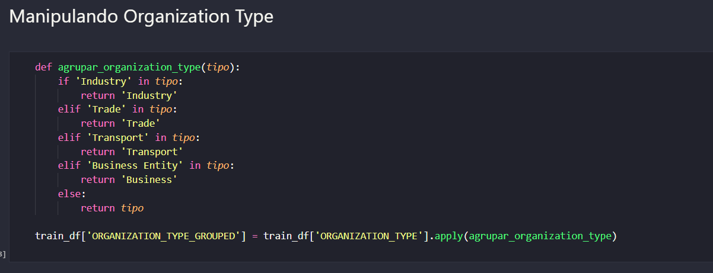

- **Análise Exploratória dos Dados (EDA)**: Realizei a EDA de todos os 4 datasets. O primeiro ponto a ser destacado é que a variável `TARGET`, presente no dataset principal, está desbalanceada. Abaixo está um gráfico que ilustra essa desproporção:

 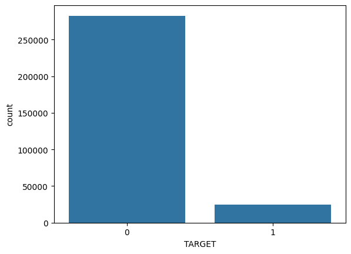 

Apesar do desbalanceamento, optei por **não** utilizar técnicas de balanceamento devido a sua complexidade e o fato de que para o escopop do projeto em questão seria a principal inviável, mas utilizei o parâmetro **stratify** no train_test_split para manter a proporção das classes durante a divisão dos dados.

Durante a EDA, analisei diversas variáveis, contudo não estarei inserindo neste documento a análise completa, uma vez que eram 4 datasets diferentes com muitas variáveis, mas você pode encontrar a análise completa no notebook do projeto. Para isso acabei dividindo-as entre numéricas e categóricas:

  - Para as variáveis numéricas, gerei gráficos como histogramas e boxplots com o objetivo de identificar a distribuição e se havia anomalias nas features dos datasets. Abaixo segue o exemplo da plotagem dos gráficos do dataset principal:

 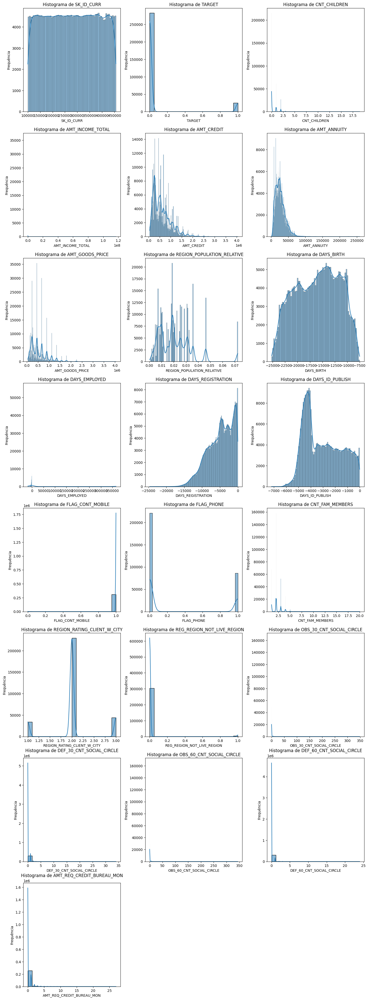 

 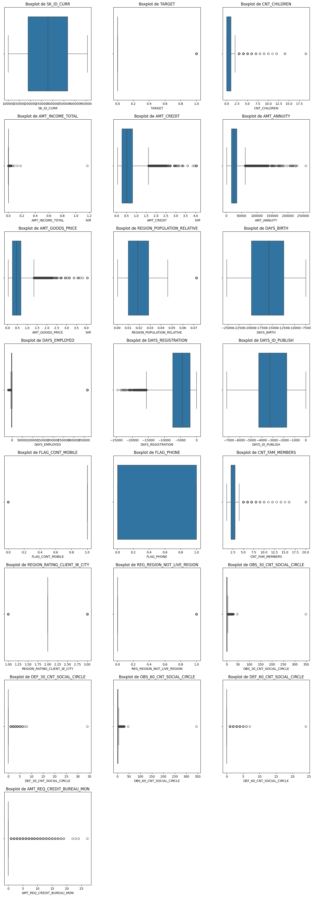 

  Além disso, para entender a relação entre as variáveis numéricas e a variável TARGET, gerei uma matriz de correlação de Spearman. Essa análise ajudou a identificar quais variáveis tinham uma associação mais forte com a TARGET. Abaixo está a matriz de correlação:

 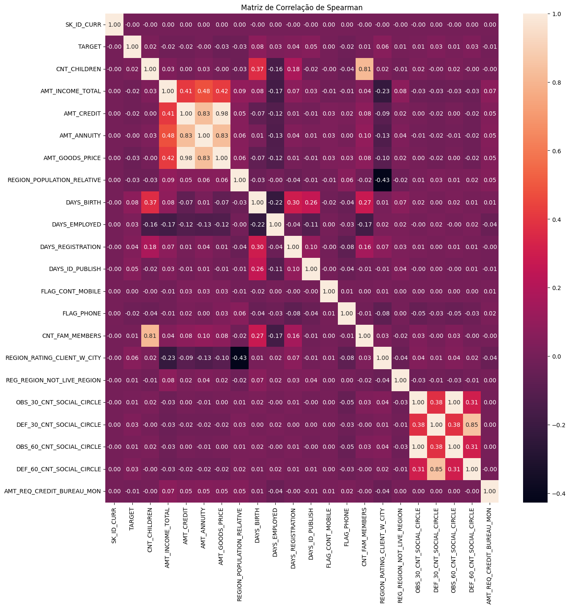 

  - Para as variáveis categóricas, utilizei CountPlots e ValueCounts para entender as categorias, por exemplo:

 

    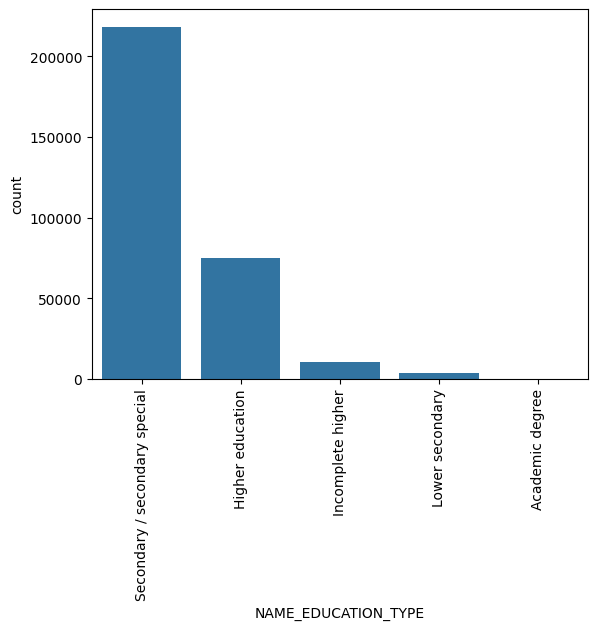
    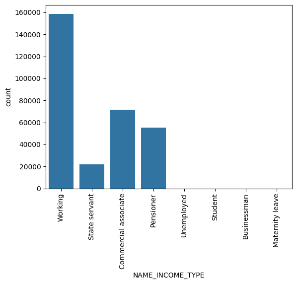
    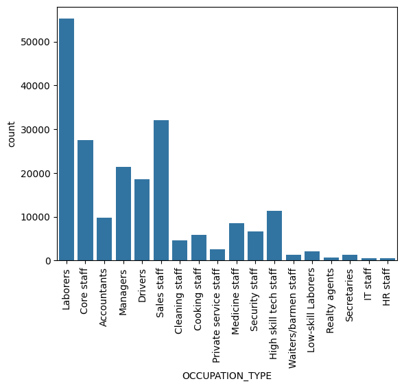
  

- **Merge dos Datasets**: Posteriormente, fiz o merge entre os 4 datasets, utilizando funções de agregação nos 3 datasets secundários antes de juntá-los ao dataset principal. O merge foi realizado através do identificador único `SK_ID_CURR`:

 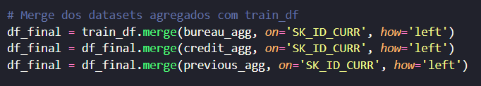 

Após o merge, percebi que algumas variáveis possuiam uma grande quantidade de valores faltantes, dessa forma defini um novo threshold de 60% e apliquei no novo dataset gerado, sendo assim o dataset final ficou com shape de: **(307511, 56)** sendo o primeiro a quantidade de linhas e o segundo a quantidade de colunas.

- **Pré-processamento dos Dados**: Inicialmente, dividi meus dados em treino e teste para evitar o *data leakage*, sendo 30% dos dados para teste e 70% para treino. Depois construí um **pipeline de pré-processamento**, onde tratei os valores faltantes das variáveis numéricas com a *mediana* e das categóricas com a *moda*. Optei por não tratar outliers, pois isso removeria muitas linhas do dataset.

 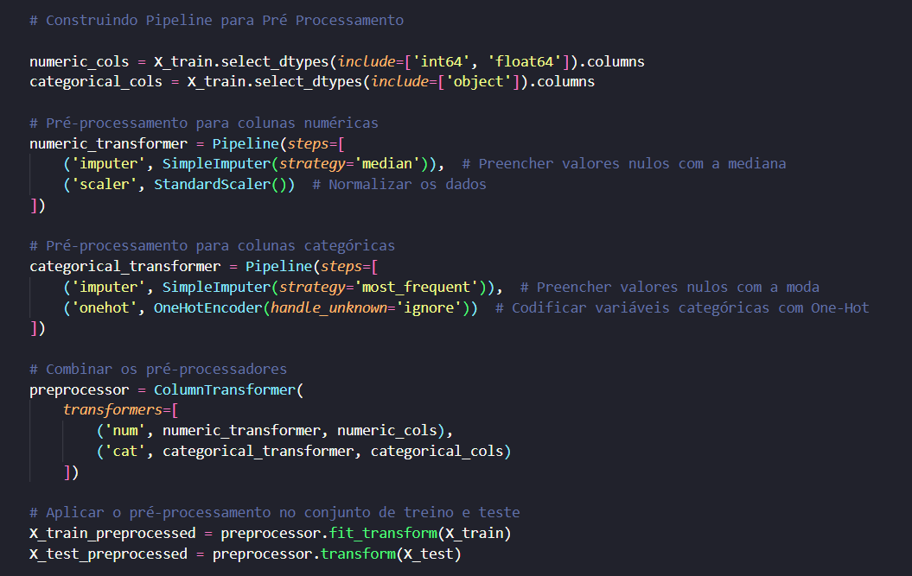 

- **Treinamento dos Modelos**: Treinei modelos de **Regressão Logística** e **Gradient Boosting**. O Gradient Boosting apresentou o *melhor* desempenho entre os dois, baseado nas métricas mais conhecidas de classificação como accuracy, precision e etc.

- **Métricas e Avaliação de Desempenho**: Abaixo estão as métricas de avaliação de desempenho de cada modelo. O Gradient Boosting errou menos, mas ambos os modelos tiveram dificuldades em prever a classe minoritária (1) devido ao desbalanceamento. 

    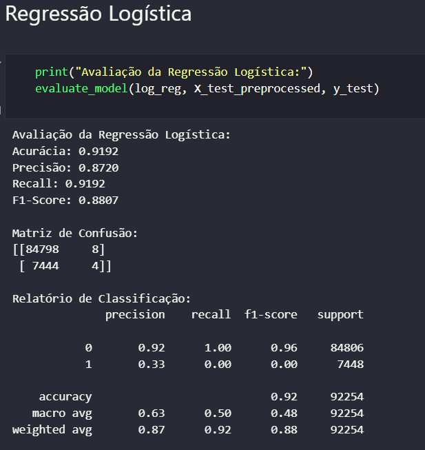
    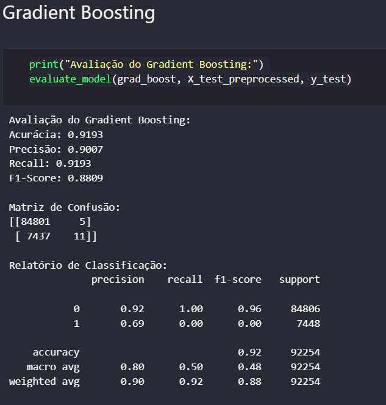

 Para analisar melhor o desempenho de ambos, foi gerada a Curva ROC, mostrando como o Gradient Boosting foi ligeraimente melhor do que a Regressão Logística.

  

- **Teste com Novos Dados**: Para validar o modelo, realizei previsões com um novo conjunto de dados. A conclusão foi que o desbalanceamento influenciou significativamente o modelo, já que a maioria das previsões foi para a classe 0 (majoritária). Abaixo está um gráfico que ilustra essa tendência:

  

Além disso, utilizei o `predict_proba` para verificar a probabilidade que o modelo atribuía a cada classe. O gráfico de boxplot abaixo mostra que o modelo atribui, em média, a partir de 60% de probabilidade para a classe 0 e a partir de 20% para a classe 1:

  

Por último, criei um arquivo de [sample submission](./data/submission.csv), que pode ser encontrado na pasta [data](./data/)

## 🎯 Conclusão
Este projeto de modelagem de risco de crédito foi uma excelente oportunidade para aplicar conceitos de machine learning e análise de dados em um problema real. Apesar dos desafios enfrentados, como o desbalanceamento da variável `TARGET` e a complexidade dos datasets, o modelo de Gradient Boosting apresentou um desempenho satisfatório, embora com limitações na previsão da classe minoritária.

Por fim, o projeto reforçou a importância de uma análise exploratória detalhada e de um pré-processamento cuidadoso dos dados, além do fato de que o conhecimento sobre a área de negócios é fundamental para entender e resolver o problema da modelagem de risco de crédito. A bagagem que esse projeto trouxe, principalmente por ser mais complexo que os demais feitos anteriormente, se tornou um aprendizando excelente e desafiador.
